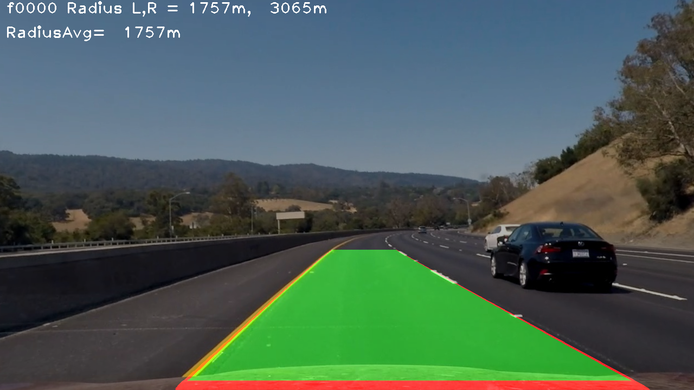
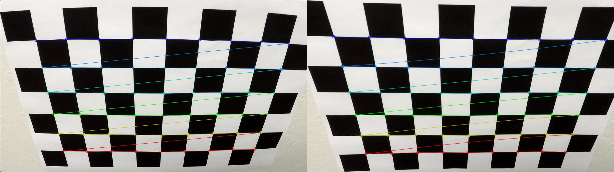
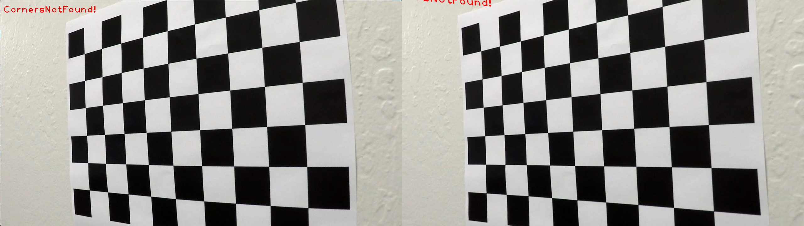
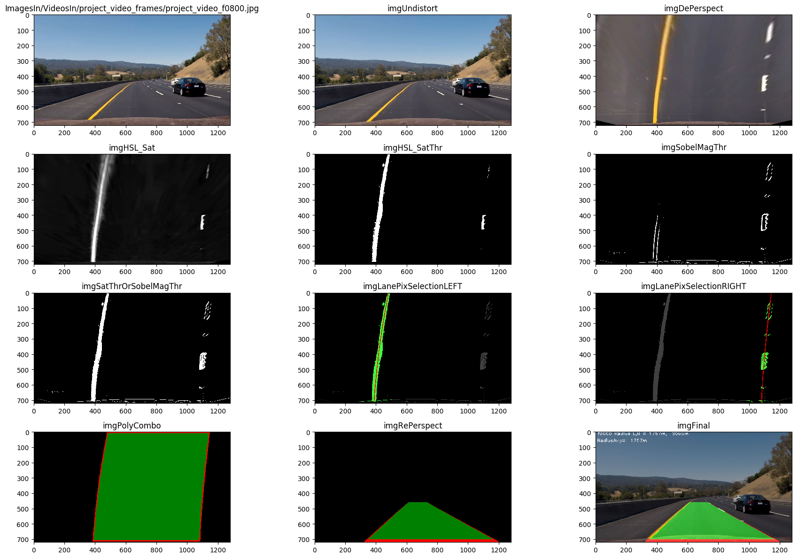

# **Proj2: Advanced Lane Finding** 
### Submission writeup: ChrisL




<br/>

## **Overview**
Another fun but challenging assignment.
The goals / steps of this project are the following:

* Compute the camera calibration matrix and distortion coefficients given a set of chessboard images.
* Apply a distortion correction to raw images.
* Use color transforms, gradients, etc., to create a thresholded binary image.
* Apply a perspective transform to rectify binary image ("birds-eye view").
* Detect lane pixels and fit to find the lane boundary.
* Determine the curvature of the lane and vehicle position with respect to center.
* Warp the detected lane boundaries back onto the original image.
* Output visual display of the lane boundaries and numerical estimation of lane curvature and vehicle position.


--- 

---

<br/>

## **Reviewer Usage Notes**

###     Use **carnd-term1 python3** conda environment
I am using the pyhon3 conda environment provided in the starter kit.
I believe that has all dependencies met for my code.

###     Read the README cell at the beginning of P2Main notebook
There are some global switches that may impact smooth running in
a new environment and to help you select which functionality to 
observe.

### Run P2Main.ipynb before other notebooks
P2Main depends on cal files present in repo. Other notebooks write
those files... and could potentially 'damage' them which
would in turn cause P2Main to malfunction.

Also I apoligize that the repo is so big - I accidentally
pushed a bunch of image files and I didn't have time 
to cleanup so that a shallow clone would work.

<br/>

--- 
--- 

<br/>

## **Project components and modules.**  
The primary files of interest are in the root directory:

* **P2Main.ipynb** 
The project main code. Takes image/video input, finds lanes and saves
or displays image/video output showing the found lanes.

* **CameraCal.ipynb** 
Code for finding camera distortion calibration values and
determining perspective warp values.

* **CameraPerspectiveWarpMatrix.pypicke & CameraDistortionCalVals.pypickle** 
These binary 'pickle' files contain the CameraCalVals created by CameraCal 
and read by P2Main. 
---
* **Dev/Debug Notebooks** 

The following are Dev/Debug notebooks that I used to develop functions
before integrating the useful functions into P2Main. They are not required
and do not require review. And they are poorly annotated and may
need effort to get to run in the cloned environment. And in many
cases they contain older versions of functions that have been modified 
in P2Main

They remain here because they contain functions that I may yet 
integrate into P2Main

* **SlidingWindow.ipynb** 
This is where I developed the sliding window lane finding functions.

* **sobel.ipynb** 

* **SplitVideo.ipynb** 
This is a utility for converting a video to individual jpegs. 
This was very useful for locating the most difficult frames of the
input video for analysis.

* **P1.ipynb** 
This is the main notebook from Project1 and has image processing functions
that are of use to P2Main

* **```*NB.py``` files** 
The ```*NB.py``` files are text file 'mirrors' of the NoteBooks that I create 
when making commits because plain text files are more convenient
for repo history review. 

---

### Camera Distortion Calibration
Camera lenses create curved distortion of images that creates errors
in when attempting to determine the curvature of image lines detection. 
To correct those images
to a straigtened line image one must take images of known "chessboard" straight
lines, provided in the template repo, 
and determine an un-distortion transform that, when applied to 
and input image, will make the images lines straight.
OpenCV provides routines to do all of this as illustrated in the online modules
I adapted that code into my **CameraCal.ipynb** notebook, described below.

#### TopLevel Cal function: CameraCal_DoDistortionCal()
This is the cell/function to call when evaluating the CameraCal notebook.
It is called automatically with notebook RunAllCells. The subsequent
important functions are describe here.

This top level scaffold function initiates a calibration run. 
It opens all of the calibration files and feeds them
to``` CameraCal_CalcCalValsFromImages()```. 
which in turn calls 

    trueCornerPoints, foundCornerPoints = CameraCal_FindCorners(calImages, numCornersXY)

which uses ```cv2.findChessboardCorners()``` to locate the image coordinates of the
chessboard corners and prepares a matching list of 'true' coordinates
to which the corners should map.

Here is an image the shows an the corners that have been found 
on an calibration input file and that same image after undistortion.




Those set of coordinates are then fed to ```CameraCal_CalcCalValsFromPoints()```
which uses

    cv2.calibrateCamera(trueCornerPoints, foundCornerPoints, imgSize, None, None)

to determine the values ```ret, mtx, dist, rvecs, tvecs```
which are the parameters that represent the undistort transform.
Once these parameters are known one can undistort an input image by calling

    imgOut = cv2.undistort(imgIn, dictCameraCalVals["mtx"], dictCameraCalVals["dist"], None, dictCameraCalVals["mtx"])

which returns a straigtened line output image, such as this before
and after image




These parameters only need to be calculated once for a camera, so this notebook
serializes them to a file ```CameraDistortionCalVals.pypickle```
which is read by P2Main notebook and used as the first step of the image preprocess
pipeline.

---

<br/>

### Camera Perspective Warp Calibration
In order to accurately determine lane line geometry it is useful 
to alter camera POV image, inherently a perspective view, to a 
map or birds eye view so that all parallel lines are indeed parallel
and the X scale and Y scale are consistent throughout the image (though
not neccesarily to each other)

 **CameraCal.ipynb** contains utilities for determining perspective
 warp pararmeters. Without calibration images created for
 the purpose this is an emprirical and somewhat arbitrary process.
 
What I did was use a camera POV image with straight lines and selected
4 points on those lines that describe a trapezoid (because of perspective). Then
chose corresponding 4 points of a rectangle to which I wanted those points to 
map to. I used sample images to choose points similar to those used
in the instruction tutorials. This is because, 1) the tutorials work.
2) The metersPerPixelX and  metersPerPixelY provided in the tutorials
are entirely dependent on the points selected.

Here are the points I selected

    def GetPerspectiveWarpTrapezoids():
    """
    Returns the src and dest trapezoids used by GetPerspectiveWarpTransform/cv2.getPerspectiveTransform
    """
    # Define the location of points of the trapezoid
    # as seen in the POV image. These are determined empirically
    # by manually selecting the pixel points in the calibration image
    # in EmpiricalWarpTrapazoidTool()
    
    # 4 [X,Y] coords from the TopLeft CounterClockWise: LeftTop LeftBottom, RightBottom, RightTop
    srcTrap = np.float32([
                     [580, 460], # LT
                     [213, 718], # LB
                     [1103, 718],# RB
                     [705, 460]])# RT
 
    # Temp vals for readability    
    (srcLT, srcLB, srcRB, srcRT)  = srcTrap

    # Define the location to where each those points will map to
    # in the destination image. Move the bottoms in, and the tops out, 
    destL= (srcLT[0] + srcLB[0])/2 - 100
    destR= (srcRT[0] + srcRB[0])/2 + 100
    destT= 0
    destB= 715

    # Define the points of the destination image to which the src trapezoid point should map to
    destRect = np.float32([
                     [destL, destT],  # LT
                     [destL, destB],  # LB
                     [destR, destB],  # RB
                     [destR, destT],])# RT

    #print("Dest L={} R={} T={} B={}".format(destL, destR, destT, destB))
    #print("dstRect",destRect)
    return(srcTrap, destRect)

Which finalized to

    srcTrap 
    [[  580.   460.] # LT
    [  213.   718.]  # LB
    [ 1103.   718.]  # RB
    [  705.   460.]] # RT
    dstRect 
    [[  296.5     0. ]
    [  296.5   715. ]
    [ 1004.    715. ]
    [ 1004.      0. ]]

These points are then fed to on OpenCV function that calculates a 
matrix that defines a transform that performs this mapping of points.

    matTransform = cv2.getPerspectiveTransform(srcTrap, destRect)

to actually perform the transform you must call 

    imgWarped = cv2.warpPerspective(imgIn, matTransform, img_size, flags=interpolation)
 
If the points are well chosen the warped output image should be a  map view
that as no perspective.

I suspect that a good perpective warp is essential to a good pipeline.
The warp process does a lot pixel interpolation that may influence 
how well lines and edges can be detected.

---

<br/>

### Image PreProcessing Pipeline
ProProcessing is orchestrated in the function ```imgSobelMagThr()```

Here is a visual view of my image pipeline, which illustrate the pre-processing
imaging steps and the lane finding steps. The image annotations will
be referred to in the following description of the PreProcess pipeline
and line finding steps.





#### 1. Undistort (imgUndistort)
This step applies the camera disortion undistort function, as described above,
to the raw input POV image using the previously determined parameters that
have been saved to ```CameraDistortionCalVals.pypickle```

#### 2. De-perpective warp (imgDePerspect)
Create a top down map-view using the previously determined parameters that
have been saved to ```CameraPerspectiveWarpMatrix.pypickle```
In retrospect I beleive this should be applied later in the pipeline

#### 3a. Create an HSL saturation image (imgHSL_Sat)
This applies cv2 convert imgDePerpect from RGB to HSL, then 
extracts only the saturation channel

#### 3b. Create HSL saturation threshold image (imgHSL_SatThr)
Applies a threshold to imgHSL_Sat to select only highly saturated pixels.
This is good for yellow lines, but opening threshold to catch white lines also 
let in road noise.

#### 4a. Create a SobelXY edge detection magnitude (not shown)

#### 4b. SobelMagnitude threshold (imgSobelMagThr)
This seemed good at filtering in white lines in difficult lighting
transitions.

#### 5. Create ORed composite of imgHSL_SatThr|imgSobelMagThr (imgSatThrOrSobelMagThr)
This was the final preprocess step and was the image used in the lane finding


### Line finding processing
Infomation for the 2 lines in held in a Class object CImageLine.
There is one of these objects per Lef and Right Line
The main function for Line finding is handled in a class member function
```CImageLine::CalcPolyFit(self, imgIn):```
This function accepts the preprocessed image and performs the following

#### 1 Selects a group of candidate line pixels (Green pix in imgLanePixSelectionRIGHT/LEFT)
It does this in one of 2 ways depending on whether a polynomial
was found on the previous image.

#### 1a If hasPoly:
Uses that old polnomial to generate a curved mask to select 
pixels. Since images change very little this mask should catch
all the new line pixels. These are return for the next step

#### 1b If Not hasPoly:
Run a sliding window up the window, each time finding the averageX pixels
to adjust the midpoint of the next window.
All of the pixels found in these windows are combined and returned for the
next step.

#### 2 Calculate polynomial fit (Red pix in imgLanePixSelectionRIGHT/LEFT)
If there are enough selected pixels from the previous step they are passed to
```np.polyfit(selectedPixelsY, selectedPixelsX, 2)```
This fits a polynomial (parabola) and returns the coeficients.
This parabola describes the line (in pixel coordinates)

If there are not enough pixels for a reliable fit then the old poly is
reused.

#### 3 Calulate radius of curvature (text on imgFinal)
This is the value that would be used to control steering, presumably.
Used the formula provided in the tutorials and modified it 
to manage change of coordinate systems to meters. This is
run on the polynomial for each laine to calculate the radius of
curvature for that line. The average is considerd the final
line curvature.

### Final Image Processing 
To generate the final image that will be used as a frame
in the output video we create on overlay of the found lane as
follows
#### 1 Draw a closed polygon using the 2 Line polynomials (imgPolyCombo)
The fill is green and the red sides are the polynomials. The red
top and bottoms are lines connecting the tops and bottoms of the
line polynomials.

#### 2 RePerspective that polygon into the POV perspective (imgRePerspect)
This uses the save OpenCV warp function and matrix with a flag to do 
inverse warp.

#### 3 Overlay that on the original image (imgFinal)
This is actually onto the imgUndistort image,


### Making the final video
To make the final output video I used a similar arrangement as project 1
to open a video file (project_video.mp4) and send those frames
to P2Main(). P2Main() iterates over all those input frames
an assembles and returns a list of output frames (imageFrames).
Those frames are assembled into video clip

    movieClipOut = mp.ImageSequenceClip(imageFrames, fps=25)

and saved as an mp4 file

    movieClipOut.write_videofile(fileOutName, fps=25, codec='mpeg4')

Here is a link to my final video

[project_video_out.mp4](./project_video_final.mp4)


### Discussion
Overall I am happy that my code was able to process the basic
input video as well as it did. It took some fiddling about
to get it to run acceptablably through the whole video.
I went completely haywire on the challenge video. I wish there
were more time to tiddle with it.

#### 1. Problems I encountered
* Image viewing
The project involves a lot of images. Permutations of permutations of
sequences of images. I found that I spend an inordinate amount of
time wrestling with matplotlib so that I could view all of the 
many images to undertand what was going on. I find that matplotlib 
and jupyter are not quite up to the task of doing that conveniently.
At least now I have some workable utility functions that mostly do what I
need. 

* Primitive dev debug process
Jupyter is a fun development environment but it is primitive
for debugging complicated code. After this project I will try PyCharm
to see if it is a real source code debugger with break on error, step
through code (especially go backwards), variable inspection and manipulation (especially up the call stack), 
edit in place debugging, conditional breakpoints, refactoring support, at least
rename identifier. 

I find that I am
practicing the crash-and-burn printf debugging of 30 years ago!
It is exceptionally slow going. I wil try pdb in jupyter, it should help,
but it still seem like gdb of 30 years ago.

* Radius Calculation
My radius calculation is way out of whack. It works on the sample
polynomial fine but it jumps all over the place frame to frame.
I attempted to use a change of variable substituion to convert from pixels 
to meters, but I must have something out of place.

#### Improvements
There are a few glitches on the project_video - at the 
bridge crossings, but I ran out of time for improving the pipeline. 
Here are a few ideasthat I would implement to solve those glitches
and maybe take on the challenge videos.

* Sanity check the polynomials and radii
Do the lines intersect in near field? Are the curved in different directions?
Are the radii radically different? Any of these conditions could be an indicator 
that a recalc is needed.

* Check the 'spread' or deviation of selected points from the
predicted poly path (or rectangles) Well processed lane lines a
going to have a small deviation. A big deviation could be an indicator 
that a recalc is needed.

* Precalculate several preprocess pipeline permutations. When using
one preprocess image yields indicators such as above, go back and try again.

* I am pretty sure that I have my perspective warp to early in the
pipeline. If I had more time I would go back and try it after the
edge detections.

* Try other preprocessing steps.
There are a variety of things illustrated in the tutorials that I did
not use at all. Some of the basic image transforms, canny and hough.
And logical combinations of all the steps. The permutations
are endless, but alas so little time...

### Links

[Rubric](https://review.udacity.com/#!/rubrics/571/view) 
